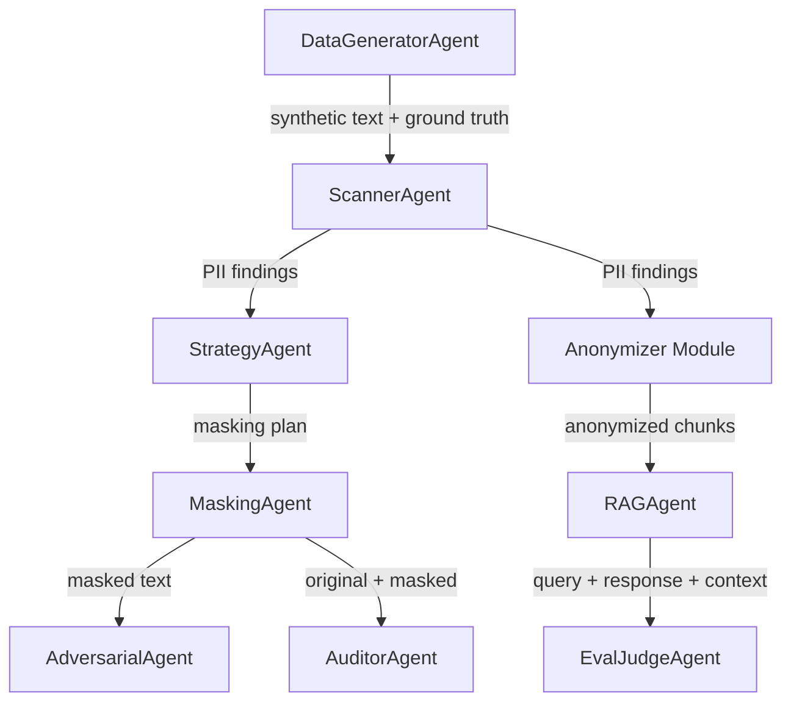
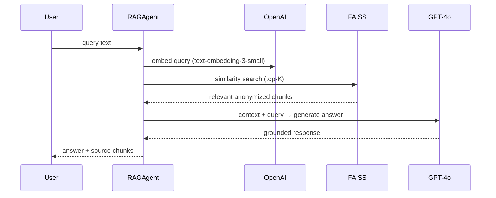
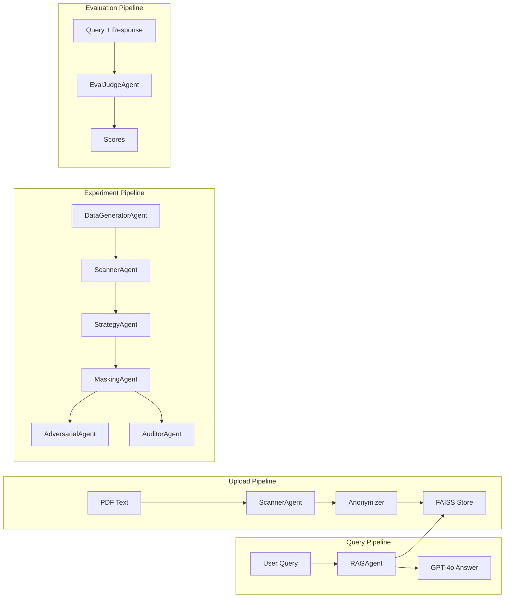

# DocSentry — Agent Definitions

## System Overview

DocSentry uses a **multi-agent architecture** where specialized AI agents collaborate to detect, anonymize, attack-test, and audit PII in documents. All LLM-powered agents inherit from [BaseAgent](file:///Users/prakharsrivastava/Documents/DocSentry-conference/agents/base_agent.py#5-32), which provides a standardized OpenAI GPT-4o interface with JSON-mode parsing.



---

## Base Agent

| Property | Value |
|---|---|
| **File** | `backend/agents/base_agent.py` |
| **LLM** | OpenAI GPT-4o |
| **Temperature** | 0.7 |
| **Output** | JSON (default) or raw text |

**Core Method**: [call_llm(system_prompt, user_prompt, json_mode=True) → dict](file:///Users/prakharsrivastava/Documents/DocSentry-conference/agents/base_agent.py#11-32)
- Wraps `openai.ChatCompletion.create()` with automatic JSON parsing
- Used by all LLM-powered agents as their communication backbone

---

## Agent 1: Scanner Agent (PII Detector)

| Property | Value |
|---|---|
| **File** | `backend/agents/scanner.py` |
| **Class** | [ScannerAgent(BaseAgent)](file:///Users/prakharsrivastava/Documents/DocSentry-conference/agents/scanner.py#3-30) |
| **Purpose** | Detect and classify PII entities in unstructured text |
| **Used in** | Upload flow (`anonymizer.py`), Experiment flow |

### System Prompt
> You are an expert PII Detection Agent. Analyze the text and categorize findings using ONLY these categories: PERSON, LOCATION, DATE, CONDITION, CONTACT, SSN.

### Input / Output

| | Format |
|---|---|
| **Input** | Raw text string |
| **Output** | `{"findings": [{"text_segment": str, "pii_type": str, "risk_level": "High/Medium/Low", "reasoning": str}]}` |

### PII Categories

| Category | Examples | Risk Level |
|---|---|---|
| `PERSON` | Patient names, doctor names | High |
| `LOCATION` | Cities, ZIP codes, addresses | Medium |
| `DATE` | Birthdates, admission dates | Medium |
| `CONDITION` | Medical diagnoses | High |
| `CONTACT` | Phone numbers, email addresses | High |
| `SSN` | Social Security Numbers, IDs | Critical |

### Design Decisions
- Uses **LLM-based NER** rather than regex or spaCy for superior context understanding
- Categories are deliberately constrained to 6 types for consistent evaluation metrics
- No confidence score returned currently — the `EvalJudgeAgent` handles quality assessment separately

---

## Agent 2: Strategy Agent (Privacy Strategist)

| Property | Value |
|---|---|
| **File** | `backend/agents/strategy.py` |
| **Class** | [StrategyAgent(BaseAgent)](file:///Users/prakharsrivastava/Documents/DocSentry-conference/agents/strategy.py#4-21) |
| **Purpose** | Decide optimal masking strategy for each detected PII entity |
| **Used in** | Experiment flow |

### System Prompt
> You are a Privacy Strategy Agent. Input: Text + PII Findings. Output: A Masking Plan optimized for Utility vs Privacy.

### Masking Strategies

| Strategy | When Used | Privacy | Utility |
|---|---|---|---|
| `REDACT` | High-risk PII (SSN, exact IDs) | ★★★ | ★ |
| `SYNTHETIC` | Names, entities needing referential integrity | ★★ | ★★★ |
| `GENERALIZE` | Dates, ages, locations for analytics use | ★★ | ★★ |

### Input / Output

| | Format |
|---|---|
| **Input** | `{"text": str, "findings": List[Finding]}` |
| **Output** | `{"masking_plan": [{"target_text": str, "strategy": "REDACT|SYNTHETIC|GENERALIZE"}]}` |

### Design Decisions
- Strategy selection is **context-aware** — the LLM considers the full text when deciding, not just the entity type
- Returns empty plan for empty findings (fast path, no LLM call)

---

## Agent 3: Masking Agent (Privacy Executor)

| Property | Value |
|---|---|
| **File** | `backend/agents/masker.py` |
| **Class** | [MaskingAgent(BaseAgent)](file:///Users/prakharsrivastava/Documents/DocSentry-conference/agents/masker.py#4-45) |
| **Purpose** | Execute masking plan while maintaining cross-document consistency |
| **Used in** | Experiment flow |

### System Prompt
> You are a Privacy Masking Agent. Rules: If entity exists in Consistency Map, reuse that replacement. NAMEs → synthetic names. DATEs → generalized. CONTACTs → generic placeholders. SSNs → complete redaction.

### Input / Output

| | Format |
|---|---|
| **Input** | `{"original_text": str, "detected_pii": List, "current_consistency_map": Dict}` |
| **Output** | `{"masked_text": str, "new_mappings": {"Original": "Replacement"}}` |

### Consistency Map
- **Purpose**: Ensures the same PII value always maps to the same replacement across all documents
- **Example**: If `"John Doe"` → `"Michael Smith"` in document 1, the same mapping is enforced in document 2
- **Persistence**: In-memory dict on the [MaskingAgent](file:///Users/prakharsrivastava/Documents/DocSentry-conference/agents/masker.py#4-45) instance; persists across calls within one session
- **Metric Impact**: Directly feeds the **Consistency Score** metric

---

## Agent 4: Adversarial Agent (Red Team)

| Property | Value |
|---|---|
| **File** | `backend/agents/adversarial.py` |
| **Class** | [AdversarialAgent(BaseAgent)](file:///Users/prakharsrivastava/Documents/DocSentry-conference/agents/adversarial.py#4-24) |
| **Purpose** | Attempt re-identification attacks on masked text to test anonymization robustness |
| **Used in** | Experiment flow, Adversarial Success Rate metric |

### System Prompt
> You are a Red Team Privacy Researcher. Goal: Attempt to re-identify the original PII from the masked text. Methods: (1) logical leaks, (2) formatting leaks.

### Attack Vectors

| Vector | Description | Example |
|---|---|---|
| **Logical Leaks** | Contextual inference from surrounding text | "Hospital in [City] near the Golden Gate" → San Francisco |
| **Formatting Leaks** | Partial data exposure through incomplete masking | "SSN: ***-**-1234" → last 4 digits exposed |
| **Cross-Reference** | Combining multiple masked fields | Age + ZIP + gender combo → narrow population |

### Input / Output

| | Format |
|---|---|
| **Input** | Masked text string |
| **Output** | `{"attack_successful": bool, "confidence": "High/Medium/Low", "reasoning": str}` |

### Metric Impact
- `attack_successful` → feeds **Adversarial Success Rate (ASR)** calculation
- Lower ASR = stronger anonymization

---

## Agent 5: Auditor Agent (Utility Evaluator)

| Property | Value |
|---|---|
| **File** | `backend/agents/auditor.py` |
| **Class** | [AuditorAgent(BaseAgent)](file:///Users/prakharsrivastava/Documents/DocSentry-conference/agents/auditor.py#3-25) |
| **Purpose** | Evaluate data utility preservation after masking |
| **Used in** | Experiment flow (optional), Data Utility metrics |

### System Prompt
> You are a Data Utility & Fidelity Auditor. Compare Original vs Masked. Analyze for: (1) Statistical Fidelity, (2) Information Loss, (3) Utility Score 0-100.

### Input / Output

| | Format |
|---|---|
| **Input** | `"Original: {text}\n\nMasked: {masked_text}"` |
| **Output** | `{"utility_score": int(0-100), "fidelity_rating": "High/Medium/Low", "information_loss_critique": str}` |

### Scoring Rubric

| Utility Score | Fidelity | Meaning |
|---|---|---|
| 80-100 | High | Meaning fully preserved, analytics-ready |
| 50-79 | Medium | Some context lost, usable with caveats |
| 0-49 | Low | Severe information loss, limited analytical value |

---

## Agent 6: Data Generator Agent (Synthetic Data)

| Property | Value |
|---|---|
| **File** | `backend/agents/generator.py` |
| **Class** | [DataGeneratorAgent](file:///Users/prakharsrivastava/Documents/DocSentry-conference/agents/generator.py#7-69) |
| **Purpose** | Generate synthetic medical records with embedded PII and ground truth labels |
| **Used in** | Experiment flow |

> [!NOTE]
> This agent does **not** extend [BaseAgent](file:///Users/prakharsrivastava/Documents/DocSentry-conference/agents/base_agent.py#5-32) — it uses Python's `Faker` library for deterministic data generation, no LLM calls needed.

### Output Format
```json
{
  "text": "Patient John Doe (SSN: 123-45-6789) admitted for Hypertension...",
  "ground_truth": [
    {"text": "John Doe", "type": "PERSON"},
    {"text": "123-45-6789", "type": "SSN"},
    {"text": "Hypertension", "type": "CONDITION"}
  ],
  "qis": {"age": 42, "zip": "90210"},
  "sensitive": "Hypertension"
}
```

### Templates (4 variations)

| # | Format | PII Included |
|---|---|---|
| 1 | Formal admission with SSN | PERSON, SSN, CONDITION, CONTACT |
| 2 | Informal clinical note | PERSON, CONDITION, LOCATION |
| 3 | Identity verification | PERSON, SSN, CONDITION |
| 4 | Referral letter | PERSON, CONDITION, CONTACT |

---

## Agent 7: RAG Agent *(New)*

| Property | Value |
|---|---|
| **File** | `backend/agents/rag_agent.py` |
| **Class** | `RAGAgent(BaseAgent)` |
| **Purpose** | Orchestrate retrieval-augmented generation over anonymized document store |
| **Used in** | `/query` endpoint |

### System Prompt
> You are a document Q&A assistant. Answer the user's question based ONLY on the provided context chunks. If the information is not in the context, say so. Do not fabricate information.

### Pipeline



### Input / Output

| | Format |
|---|---|
| **Input** | `{"query": str, "top_k": int (default 3)}` |
| **Output** | `{"answer": str, "source_chunks": [{"text": str, "doc_id": str, "score": float}], "anonymized": bool}` |

### Design Decisions
- Operates **exclusively on anonymized data** — never sees original PII
- Returns source chunks for transparency and groundedness verification
- `anonymized: true` flag confirms the response is PII-safe

---

## Agent 8: Evaluation Judge Agent *(New)*

| Property | Value |
|---|---|
| **File** | `backend/agents/eval_judge.py` |
| **Class** | `EvalJudgeAgent(BaseAgent)` |
| **Purpose** | LLM-as-judge for automated quality assessment of RAG responses |
| **Used in** | `/evaluate/rag_response` endpoint |

### System Prompt
> You are an impartial judge evaluating AI responses. Score on two dimensions:
> 1. **Answer Relevancy** (0-10): Does the response address the query?
> 2. **Groundedness** (0-10): Is every claim supported by the provided context?
>
> Return JSON with scores and detailed reasoning for each.

### Input / Output

| | Format |
|---|---|
| **Input** | `{"query": str, "response": str, "expected_answer": str, "context_chunks": List[str]}` |
| **Output** | `{"relevancy_score": float(0-10), "groundedness_score": float(0-10), "relevancy_reasoning": str, "groundedness_reasoning": str}` |

### Scoring Rubric

| Score | Relevancy | Groundedness |
|---|---|---|
| 9-10 | Fully answers the query with all key points | Every claim traceable to context |
| 7-8 | Addresses query but misses minor details | Most claims supported, minor inferences |
| 4-6 | Partially relevant, significant gaps | Mix of supported and unsupported claims |
| 1-3 | Mostly irrelevant to the query | Mostly hallucinated or unsupported |
| 0 | Completely off-topic | Entirely fabricated |

---

## Agent Interaction Summary


