# DocSentry — Metrics Definition

## Overview

DocSentry evaluates PII anonymization and RAG agent effectiveness across **6 metric categories** and **25+ individual metrics**. These metrics enable rigorous scientific comparison for research publication.

```mermaid
graph TD
    A[Metrics Framework] --> B[PII Detection Validation]
    A --> C[Privacy Protection]
    A --> D[Data Utility]
    A --> E[Information Loss]
    A --> F[Consistency Validation]
    A --> G[RAG Quality]
    
    B --> B1[Precision / Recall / F1]
    B --> B2[Per-Category Breakdown]
    B --> B3[Confusion Matrix]
    B --> B4[False Negative Rate]
    
    C --> C1[K-Anonymity]
    C --> C2[L-Diversity]
    C --> C3[T-Closeness]
    C --> C4[Re-identification Risk]
    C --> C5[Adversarial ASR]
    
    D --> D1[Statistical Fidelity]
    D --> D2[Correlation Preservation]
    
    E --> E1[Suppression Rate]
    E --> E2[Generalization Height]
    
    F --> F1[Cross-Document Consistency]
    F --> F2[Format Preservation]
    
    G --> G1[Answer Relevancy]
    G --> G2[Groundedness]
    G --> G3[Retrieval Accuracy]
```



---

## Category A: PII Detection Validation

Evaluates how accurately the **ScannerAgent** identifies PII entities. Requires ground truth labels (provided by [DataGeneratorAgent](file:///Users/prakharsrivastava/Documents/DocSentry-conference/agents/generator.py#7-69) or manual annotation).

### A1. Precision (Positive Predictive Value)

| Property | Value |
|---|---|
| **What it measures** | Of all items flagged as PII, how many actually were PII? |
| **Formula** | `TP / (TP + FP)` |
| **Target** | ≥ 0.95 |
| **Why it matters** | High precision = fewer false alarms, less unnecessary redaction of non-sensitive data |
| **Implementation** | Fuzzy matching with type + text overlap (existing `ResearchMetrics.update_detection()`) |

**Example**: System flags 100 items as email addresses → 95 are actual emails → Precision = 0.95

### A2. Recall (Sensitivity)

| Property | Value |
|---|---|
| **What it measures** | Of all actual PII in the dataset, how much did the system catch? |
| **Formula** | `TP / (TP + FN)` |
| **Target** | ≥ 0.95 (critical for compliance) |
| **Why it matters** | Missing even one SSN or medical record number could be a regulatory breach |
| **Implementation** | Same fuzzy matching engine as Precision |

**Example**: 80 phone numbers in a document → system detects 72 → Recall = 0.90

### A3. F1 Score

| Property | Value |
|---|---|
| **What it measures** | Harmonic mean of Precision and Recall |
| **Formula** | `2 × (P × R) / (P + R)` |
| **Target** | > 0.95 for production, > 0.90 for research |
| **Why it matters** | Balances over-detection (low precision) vs under-detection (low recall) |
| **Implementation** | Computed from TP/FP/FN aggregates |

### A4. False Negative Rate (FNR)

| Property | Value |
|---|---|
| **What it measures** | Percentage of PII that slips through undetected |
| **Formula** | `FN / (FN + TP)` |
| **Target** | → 0% (especially for high-risk types: SSN, medical IDs) |
| **Why it matters** | Biggest compliance risk — a 5% FNR means 1 in 20 PII instances are exposed |
| **Implementation** | `1 - Recall` |

> [!CAUTION]
> FNR is the single most critical privacy metric. Even small FNR values on high-volume data can expose thousands of records.

### A5. Per-Category Precision / Recall / F1

| Property | Value |
|---|---|
| **What it measures** | Detection accuracy broken down by PII type |
| **Categories** | PERSON, LOCATION, DATE, CONDITION, CONTACT, SSN |
| **Why it matters** | Some PII types are harder to detect (emails ~99% vs names in unstructured text ~85%) |
| **Implementation** | Category-specific TP/FP/FN counters in `ResearchMetrics.category_stats` |

**Expected difficulty ranking** (easiest → hardest):
| PII Type | Expected Recall | Notes |
|---|---|---|
| SSN | ~98% | Distinctive format (XXX-XX-XXXX) |
| CONTACT (email) | ~97% | Standard email pattern |
| CONTACT (phone) | ~93% | Format variations |
| DATE | ~90% | Multiple date formats |
| LOCATION | ~88% | Ambiguous (city names can be person names) |
| PERSON | ~85% | Context-dependent, hardest category |

### A6. Confusion Matrix

| Property | Value |
|---|---|
| **What it measures** | Which PII types get misclassified as other types |
| **Format** | N×N matrix: actual type (rows) × predicted type (columns) |
| **Why it matters** | Identifies systematic classification errors |
| **Implementation** | Track (actual_type, predicted_type) pairs during fuzzy matching |

**Common confusion patterns to watch for**:
- Phone numbers ↔ Account numbers
- Person names ↔ Location names (e.g., "Paris", "Jordan")
- Dates ↔ Numeric IDs

### A7. Detection Confidence Distribution

| Property | Value |
|---|---|
| **What it measures** | Distribution of AI confidence scores across detections |
| **Format** | Histogram / percentile breakdown |
| **Warning signs** | Many detections near decision threshold (ambiguous), confidence drift over time |
| **Implementation** | Aggregate `risk_level` from ScannerAgent findings (High/Medium/Low mapped to numeric) |

---

## Category B: Privacy Protection

Evaluates how well anonymization prevents re-identification. Applicable to structured/tabular anonymized data.

### B1. K-Anonymity

| Property | Value |
|---|---|
| **What it measures** | Each combination of quasi-identifiers (age, ZIP, gender) appears in at least K records |
| **Formula** | `min(group_size)` where groups = `groupby(quasi_identifiers)` |
| **Target** | k ≥ 5 (moderate), k ≥ 10 (high privacy) |
| **Limitation** | Doesn't protect against homogeneity attacks |
| **Implementation** | `ResearchMetrics.measure_privacy_stats()` using pandas groupby |

**Example**: k=5 means if someone is a 34-year-old female in ZIP 90210, there are at least 4 other records with the same combination.

### B2. L-Diversity

| Property | Value |
|---|---|
| **What it measures** | Within each k-anonymous group, at least L different values exist for sensitive attributes |
| **Formula** | `min(nunique(sensitive_attr))` per group |
| **Target** | l ≥ 3 |
| **Why it matters** | Prevents attribute disclosure — if all 5 people in a group have "diabetes", that's an information leak |
| **Implementation** | `ResearchMetrics.measure_privacy_stats()` using `groups[sensitive_col].nunique()` |

### B3. T-Closeness

| Property | Value |
|---|---|
| **What it measures** | Distribution of sensitive attributes in each group should be close to overall distribution |
| **Formula** | `EMD(group_distribution, overall_distribution) ≤ t` |
| **Target** | t ≤ 0.2 |
| **Why it matters** | Prevents probabilistic inference — if 10% of population has HIV, each group should be ~10% |
| **Implementation** | `scipy.stats.wasserstein_distance` per group vs overall |

### B4. Re-identification Risk Score

| Property | Value |
|---|---|
| **What it measures** | Probability a record can be linked back to an individual |
| **Formula** | `1 / group_size` for each record (prosecutor model) |
| **Target** | Max risk < 5% |
| **Risk models** | Prosecutor (attacker knows target is in dataset), Journalist (random check), Marketer (any match) |
| **Implementation** | Uniqueness-based scoring from k-anonymity groups |

### B5. Uniqueness Rate

| Property | Value |
|---|---|
| **What it measures** | Percentage of records that remain unique (group_size = 1) after anonymization |
| **Formula** | `count(groups with size == 1) / total_records` |
| **Target** | → 0% |
| **Why it matters** | Unique records are trivially re-identifiable |

### B6. Redaction Coverage

| Property | Value |
|---|---|
| **What it measures** | Percentage of detected PII that was successfully replaced |
| **Formula** | `successfully_replaced / total_detected` |
| **Target** | 100% |
| **Implementation** | Check if each detected PII text still appears in anonymized output |

### B7. Adversarial Success Rate (ASR)

| Property | Value |
|---|---|
| **What it measures** | Percentage of re-identification attacks that succeed |
| **Formula** | `successful_attacks / total_attacks` |
| **Target** | → 0% |
| **Agent** | [AdversarialAgent](file:///Users/prakharsrivastava/Documents/DocSentry-conference/agents/adversarial.py#4-24) performs the attacks |
| **Implementation** | `ResearchMetrics.record_attack()` and `successful_attacks / total_records` |

---

## Category C: Data Utility

Evaluates how much analytical value the data retains after anonymization.

### C1. Statistical Fidelity

| Property | Value |
|---|---|
| **What it measures** | Preservation of key statistics (means, medians, standard deviations, distributions) |
| **Method** | Compare statistical summaries before/after anonymization |
| **Target** | Means within ±5%, distributions visually similar |
| **Implementation** | pandas `.describe()` on original vs anonymized datasets |

### C2. Correlation Preservation

| Property | Value |
|---|---|
| **What it measures** | Whether relationships between variables remain intact |
| **Formula** | `abs(corr_original - corr_anonymized)` per variable pair |
| **Target** | Difference ≤ 0.05 |
| **Implementation** | Compare correlation matrices (pandas `.corr()`) |

### C3. Query Accuracy

| Property | Value |
|---|---|
| **What it measures** | Whether business/analytical queries produce similar results on anonymized vs original data |
| **Method** | Run identical queries on both datasets, compare results |
| **Target** | Results match within ±10% |
| **Example queries** | "% of patients per age bracket", "Average diagnosis count by region" |

### C4. Utility Score (LLM-assessed)

| Property | Value |
|---|---|
| **What it measures** | Overall utility of masked text (0-100) assessed by AuditorAgent |
| **Agent** | `AuditorAgent.evaluate(original, masked)` |
| **Output** | `utility_score` (0-100) + `fidelity_rating` (High/Medium/Low) + `information_loss_critique` |
| **Interpretation** | 80-100 = analytics-ready, 50-79 = usable with caveats, <50 = severe loss |

---

## Category D: Information Loss

Quantifies how much data was lost or degraded during anonymization.

### D1. Suppression Rate

| Property | Value |
|---|---|
| **What it measures** | Percentage of data values removed or generalized |
| **Formula** | `values_suppressed_or_generalized / total_values` |
| **Target** | < 20% |
| **Trade-off** | Lower suppression = more utility, less privacy |

### D2. Generalization Height

| Property | Value |
|---|---|
| **What it measures** | How many levels of detail were lost through generalization |
| **Scale** | 0 = exact, 1 = minor generalization, 2 = moderate, 3 = broad category |

**Examples**:
| Original | Generalized | Height |
|---|---|---|
| Age: 34 | Age: 34 | 0 (exact) |
| Age: 34 | Age: 30-39 | 1 |
| Age: 34 | Age: 25-50 | 2 |
| Age: 34 | Adult | 3 |

### D3. Field-Level Completeness

| Property | Value |
|---|---|
| **What it measures** | Percentage of fields that remain usable after anonymization |
| **Formula** | `usable_fields / total_fields` |
| **Target** | > 80% for critical analytical fields |
| **Example** | If ZIP code column is fully suppressed → that field = 0% completeness |

### D4. Record-Level Usability

| Property | Value |
|---|---|
| **What it measures** | Percentage of records that remain useful for intended analysis |
| **Formula** | `usable_records / total_records` |
| **Example** | If over-anonymization makes 20% of records meaningless → usability = 80% |

---

## Category E: Consistency Validation

Ensures anonymization is applied uniformly and coherently.

### E1. Cross-Document Consistency Score

| Property | Value |
|---|---|
| **What it measures** | Whether the same PII value gets the same anonymized replacement everywhere |
| **Formula** | `entities_with_single_mapping / total_entities` |
| **Target** | 100% |
| **Implementation** | `MaskingAgent.consistency_map` + `ResearchMetrics.calculate_consistency_score()` |

**Example**: If `"john.doe@email.com"` → `"user_12345@email.com"` in doc 1, it must be the same in doc 2.

> [!WARNING]
> Inconsistent anonymization enables **linking attacks** — an attacker can correlate different anonymized versions of the same entity to re-identify.

### E2. Format Preservation

| Property | Value |
|---|---|
| **What it measures** | Whether anonymized data maintains expected structural formats |
| **Method** | Regex validation that output formats match expected patterns |
| **Example** | Original phone: [(555) 123-4567](file:///Users/prakharsrivastava/Documents/DocSentry-conference/main.py#11-83) → Masked: `[PHONE]` ✓ or [(555) 000-0000](file:///Users/prakharsrivastava/Documents/DocSentry-conference/main.py#11-83) ✓, not `abc123` ✗ |

### E3. Referential Integrity

| Property | Value |
|---|---|
| **What it measures** | Whether relationships between records are preserved |
| **Example** | Patient ID 12345 has 3 test results → anonymized ID still links to those same 3 results |
| **Method** | Verify foreign key relationships remain valid post-anonymization |

---

## Category F: RAG Quality (LLM-as-Judge)

Evaluates end-to-end RAG system performance using the `EvalJudgeAgent`.

### F1. Answer Relevancy

| Property | Value |
|---|---|
| **What it measures** | How well the response addresses the user's query |
| **Scale** | 0-10 |
| **Judge** | `EvalJudgeAgent` via GPT-4o |
| **Inputs** | query, response, expected_answer |

| Score | Meaning |
|---|---|
| 9-10 | Fully answers query with all key points |
| 7-8 | Addresses query but misses minor details |
| 4-6 | Partially relevant, significant gaps |
| 1-3 | Mostly irrelevant |
| 0 | Completely off-topic |

### F2. Groundedness (Faithfulness)

| Property | Value |
|---|---|
| **What it measures** | Whether every claim in the response is supported by retrieved context |
| **Scale** | 0-10 |
| **Judge** | `EvalJudgeAgent` via GPT-4o |
| **Inputs** | response, context_chunks |
| **Why critical** | Low groundedness = hallucination, which is especially dangerous with medical/legal documents |

| Score | Meaning |
|---|---|
| 9-10 | Every claim traceable to context chunks |
| 7-8 | Most claims supported, minor inferences |
| 4-6 | Mix of supported and unsupported claims |
| 1-3 | Mostly hallucinated |
| 0 | Entirely fabricated |

### F3. Retrieval Accuracy

| Property | Value |
|---|---|
| **What it measures** | Whether the correct document chunks were retrieved for a query |
| **Method** | Compare retrieved chunk IDs against expected relevant chunks |
| **Metrics** | Hit rate (at least 1 relevant chunk retrieved), Mean Reciprocal Rank (MRR) |

---

## Composite Metrics (for Paper)

### Overall Privacy Score
```
Privacy Score = w1×(1-FNR) + w2×(k_norm) + w3×(1-ASR) + w4×(redaction_coverage)
```
Where `w1=0.3, w2=0.2, w3=0.2, w4=0.3` (adjustable weights, `k_norm = min(k,10)/10`)

### Overall Utility Score
```
Utility Score = w1×(stat_fidelity) + w2×(1-suppression_rate) + w3×(utility_score_llm/100)
```

### Privacy-Utility Trade-off
Plot Privacy Score vs Utility Score across different anonymization configurations to identify optimal operating points.

---

## LaTeX Table Output

All metrics are formatted into a publication-ready LaTeX table via `ResearchMetrics.generate_latex_table()`:

```latex
\begin{table}[h]
\centering
\begin{tabular}{|l|c|}
\hline
\textbf{Metric} & \textbf{Value} \\
\hline
Global Precision & 0.XXX \\
Global Recall & 0.XXX \\
Global F1 Score & 0.XXX \\
\hline
Consistency Score & 0.XXX \\
Adversarial ASR & 0.XXX \\
K-Anonymity & X \\
L-Diversity & X \\
\hline
\end{tabular}
\caption{Overall System Performance}
\end{table}
```

---

## Recommended Testing Workflow

1. **Initial Validation**: Test on gold standard (generated) dataset, aim for F1 > 0.95
2. **Entity-Level Analysis**: Ensure all PII types meet minimum category thresholds
3. **Privacy Testing**: Verify k-anonymity ≥ 5, re-identification risk < 5%, ASR < 10%
4. **Utility Testing**: Confirm statistical fidelity, correlation preservation, query accuracy within ±10%
5. **Consistency Checks**: Validate cross-document consistency = 100%
6. **RAG Quality**: Verify answer relevancy ≥ 7/10, groundedness ≥ 8/10
7. **Production Monitoring**: Track metrics continuously, alert on degradation
